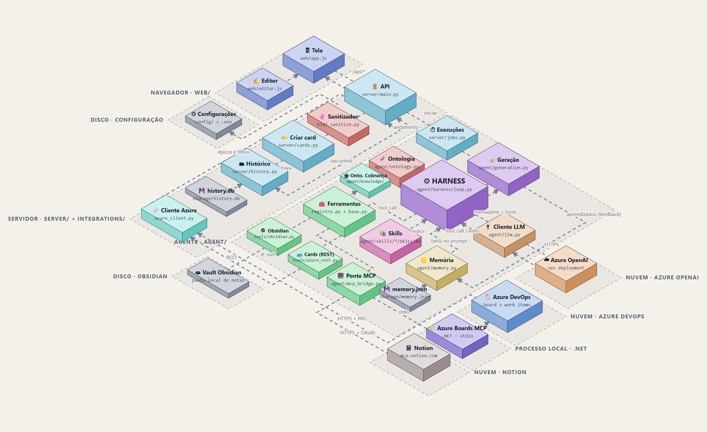

# 📝 Stories

**Stories** é uma ferramenta local que ajuda a escrever cards do Azure Boards (User Story, Technical Story e Spike). Você descreve o que precisa em poucas linhas, um assistente de IA pesquisa o contexto onde ele está (Notion, outros cards do Azure DevOps, suas anotações no Obsidian), escreve o texto do card e você refina em uma conversa. Quando estiver bom, um clique cria o card direto no board.

Roda no seu computador, no navegador. Nada é publicado em lugar nenhum além do próprio Azure DevOps, quando você clica em **Criar card**.

> **Resumo em uma frase:** em vez de abrir cinco sistemas para juntar contexto e escrever o card na mão, você diz o que quer e revisa o resultado.

---

## Sumário

1. [O problema que resolve](#o-problema-que-resolve)
2. [Como se usa (em 1 minuto)](#como-se-usa-em-1-minuto)
3. [Como funciona por dentro](#como-funciona-por-dentro)
4. [Instalação](#instalação)
5. [Como rodar](#como-rodar)
6. [Configuração (⚙️)](#configuração-️)
7. [Passo a passo de uma história](#passo-a-passo-de-uma-história)
8. [Segurança: o que a IA pode e não pode fazer](#segurança-o-que-a-ia-pode-e-não-pode-fazer)
9. [Onde ficam as coisas](#onde-ficam-as-coisas)
10. [Testes](#testes)
11. [Problemas comuns](#problemas-comuns)
12. [Limitações conhecidas](#limitações-conhecidas)
13. [Glossário](#glossário)

---

## O problema que resolve

Escrever um bom card exige juntar contexto de vários lugares: o que foi decidido no Notion, o que já existe em outros cards, o que está nas suas anotações, quais repositórios serão alterados. Esse trabalho é lento e, se feito às pressas, o texto fica genérico ou impreciso.

O Stories faz essa pesquisa por você e entrega um rascunho **baseado em fatos que encontrou**. Quando não acha algo, ele diz que não achou, em vez de inventar. O texto final continua sendo seu: você edita, discute com o assistente e só então cria o card.

## Como se usa (em 1 minuto)

1. Clique em **📝 Nova História**.
2. Escolha o **tipo de card** e o **épico** ao qual ele pertence. Os cards filhos desse épico aparecem à direita para você marcar os que se relacionam com o novo.
3. Marque de onde a IA pode buscar contexto: **Notion**, **Azure DevOps**, **Obsidian**.
4. Escreva uma **descrição breve**. Pode indicar onde procurar (uma página, um card, um arquivo) e colar links.
5. Clique em **Gerar ✨**. Acompanhe o andamento ao lado do botão.
6. Leia o comentário do assistente em **Iteração e Refinamento**, edite os textos à vontade e use **Responder** para pedir ajustes. Repita quantas vezes quiser.
7. Clique em **Criar card**. Aparece um alerta com o link do card criado, e a história fica travada e salva no histórico.

## Como funciona por dentro



> 🗺️ **Mapa interativo:** abra [`docs/arquitetura.html`](docs/arquitetura.html) no navegador. Dá para clicar em cada bloco e ver o que ele faz, por que existe e o código principal, além de um **tour guiado** que segue uma história de ponta a ponta. Os interruptores no topo (Notion, Azure DevOps, Obsidian) funcionam como os checkboxes da tela.

Pense no sistema como um escritório com cinco áreas:

| Área (cores no diagrama) | Em linguagem simples | Onde está |
|---|---|---|
| 🖥 **Tela** (azul) | O que você vê e usa no navegador: formulário, editor de texto, botões. | `web/` |
| 🚪 **Servidor** (ciano) | A recepção: recebe seus pedidos, guarda o histórico e cria o card no Azure quando você manda. | `server/` |
| ⚙ **Agente** (roxo) | O assistente que pesquisa e escreve. É um loop: pede ao modelo de IA, usa ferramentas, lê o resultado e repete até ter o texto. O "gerente" que controla tudo isso se chama **harness**. | `agent/` |
| 🧰 **Ferramentas** (verde) | As "mãos" do assistente: ler o Notion, ler cards do Azure, ler suas notas. **Só leitura.** | `agent/tools/` |
| 📒 **Memória e skills** (amarelo e rosa) | O que o assistente aprende com você e as instruções de como escrever cada tipo de card. | `agent/memory.py`, `agent/skills/` |

Do lado de fora ficam os serviços que a ferramenta usa: o **Azure OpenAI** (o modelo de IA), o **Azure DevOps** (seus cards), o **Notion** e a pasta do **Obsidian**.

### O caminho de um pedido

1. Você clica em **Gerar**. A tela envia o que você escreveu ao servidor.
2. O servidor inicia a tarefa em segundo plano (a página não trava) e a tela vai perguntando "já terminou?" a cada segundo, mostrando o que o assistente está consultando.
3. O agente monta as instruções para o modelo: quem ele é, as regras (não inventar fatos), as fontes liberadas, as skills disponíveis e a memória do que você já pediu antes.
4. O modelo decide o próximo passo e **pede** uma ferramenta ("busque no Notion por rollback da feature flag"). Quem executa é o harness, depois de conferir se a ferramenta existe, se está liberada pelos checkboxes e se os argumentos fazem sentido.
5. O resultado volta ao modelo, que pode pedir mais. Quando tem o suficiente, entrega o card pronto, em formato fixo.
6. A tela preenche o texto do card, os recursos impactados, os critérios de aceite, o título e o comentário.

### Três ideias que ajudam a entender

- **Agente** não é só uma IA que responde: é uma IA que **usa ferramentas** e decide quantas consultas fazer antes de responder.
- **MCP** (Model Context Protocol) é como uma "tomada padrão" para ligar ferramentas externas. O Stories usa duas: o **Azure Boards MCP** (programa auxiliar local) e o **Notion MCP** (serviço do próprio Notion).
- **Skills** são manuais de escrita (por exemplo, o formato do card do seu time). O assistente só lê a skill completa quando precisa dela, para não gastar atenção à toa.

---

## Instalação

**Você precisa de:**

- **Windows** com **Python 3.11** instalado.
- **Acesso ao Azure OpenAI**: endereço (endpoint), chave e o nome do *deployment* do modelo.
- **Um PAT do Azure DevOps** (Personal Access Token) com permissão de leitura e escrita em *Work Items*.
- *(Opcional)* **.NET SDK 10** e o repositório `azure-boards-mcp` compilado, para as ferramentas extras de histórico e relatórios do board.
- *(Opcional)* Uma conta no Notion com acesso ao workspace do projeto.

**Passos** (no PowerShell, dentro da pasta `stories`):

```powershell
# 1. Criar o ambiente isolado do projeto e instalar as dependências
python -m venv .venv
.\.venv\Scripts\python.exe -m pip install -r requirements.txt

# 2. Criar o arquivo de segredos a partir do modelo
copy .env.example .env
```

3. Abra o arquivo **`.env`** e preencha:

```ini
AZDO_PAT=cole_seu_pat_aqui
AZURE_OPENAI_ENDPOINT=https://seu-recurso.openai.azure.com
AZURE_OPENAI_API_KEY=cole_sua_chave_aqui
AZURE_OPENAI_DEPLOYMENT=nome_do_seu_deployment
```

> 🔒 O `.env` guarda senhas e **nunca vai para o git** (já está no `.gitignore`). Não compartilhe esse arquivo.

## Como rodar

Dentro da pasta `stories`, execute:

```powershell
.\.venv\Scripts\python.exe -m uvicorn server.main:app --port 8020
```

Depois abra no navegador: **http://127.0.0.1:8020**

Para parar, pressione `Ctrl+C` no terminal. Se estiver desenvolvendo e quiser que o servidor recarregue sozinho ao salvar arquivos, acrescente `--reload` ao final do comando.

Na **barra lateral** há quatro luzes de status: **Azure OpenAI**, **Azure DevOps API**, **Azure DevOps MCP** e **Notion MCP**. Verde é conectado. Passe o mouse sobre uma luz vermelha para ver o motivo.

## Configuração (⚙️)

Clique na engrenagem, na barra lateral. As alterações ficam em `config/settings.local.json` (fora do git).

| Campo | Para que serve |
|---|---|
| **Board** *(obrigatório)* | O **link do board** do Azure DevOps (copie da barra de endereços ao abrir o board de Stories). Daqui saem a organização, o projeto, o time e o nível do backlog. |
| **Colunas ativas de Épicos** | Marque as colunas do board de Épicos que contam como "ativas". Só os épicos nessas colunas aparecem na lista. As colunas vêm direto do seu board. |
| **Servidor Azure Boards MCP** | Caminho do arquivo `AzureBoardsMcp.Server.dll` (opcional; sem ele o Azure continua funcionando pela API direta). |
| **Wiki do Azure DevOps** | Link de uma página da wiki do time (opcional). A página vira a raiz: o assistente pode listar, buscar por título e ler as páginas abaixo dela, junto com a fonte *Azure DevOps*. |
| **Pasta raiz do Obsidian** | A pasta do seu *vault*. O assistente só lê arquivos `.md` dentro dela. |
| **Página raiz do Notion** | Link da página principal do projeto, para o assistente focar as buscas ali. |
| **Diretórios de skills e de tools** | Onde ficam as skills e as ferramentas (padrão: `agent/skills` e `agent/tools`). |
| **System prompt (persona)** | Quem o assistente "é" e como deve se comportar. Quando vazio, usa o padrão. As regras de segurança são acrescentadas automaticamente depois do seu texto. |
| **Exigir feedback humano** | Ligado por padrão: o botão **Responder** só libera depois que você avalia a última resposta do assistente (veja abaixo). Desligue quando o assistente já estiver performando bem. |

### Conectar o Notion (uma vez)

Ao lado de **Notion MCP**, na barra lateral, clique em **conectar**, entre na sua conta do Notion e autorize. Depois disso a conexão se renova sozinha.

## Passo a passo de uma história

**Boa descrição ajuda muito.** Quanto mais pistas você der, melhor o resultado. Exemplos de pistas úteis: o objetivo, por que é importante, onde há contexto ("veja o card 288965", "há uma página no Notion sobre isso", "minhas notas da reunião de 14/09"), o que já sabe que **não** faz parte do escopo.

**Atalhos do editor** (valem em todas as caixas de texto, no estilo do Notion):

| Atalho | Efeito |
|---|---|
| `Ctrl+B` / `Ctrl+I` / `Ctrl+U` | Negrito, itálico, sublinhado |
| `Ctrl+K` | Inserir ou remover link |
| `# ` + espaço | Título (use `##`, `###` para subtítulos) |
| `- ` + espaço | Lista com marcadores |
| `1. ` + espaço | Lista numerada |
| `Ctrl+Enter` | Enviar (na caixa de resposta) |

**O ciclo de refinamento**

- O assistente pode **fazer até 2 perguntas** antes de escrever, quando falta uma informação essencial. Responda no campo de resposta e clique em **Responder**.
- Depois de gerado, você pode editar qualquer texto na mão. Ao clicar em **Responder**, **todos** os textos atuais (com as suas edições) voltam ao assistente junto com a sua mensagem.
- Sua resposta pode ser um **pedido de mudança** ("simplifique o objetivo") ou um **feedback** ("gostei, mas prefiro critérios mais curtos"). Preferências que valem para as próximas histórias podem ser guardadas na memória do assistente (o aviso 🧠 aparece abaixo do comentário).
- **Avalie cada resposta do assistente** com os botões 👍 (bom), ◽ (neutro) e 👎 (ruim) em *Iteração e Refinamento*. É a medida de qualidade feita por uma pessoa, e não pelo próprio modelo. Com a opção **Exigir feedback humano** ligada, **Responder** (e o `Ctrl+Enter`) só funcionam depois da avaliação. Você pode trocar a nota até responder. A coluna `rating` de `storage/history.db` guarda **só a última** avaliação de cada história; as anteriores são sobrescritas.
- Se o título ainda não foi mexido por você, o assistente o preenche. Se você o editou, ele nunca mais o sobrescreve.

**Criar o card**

Para criar é preciso ter **título** (diferente de "Nova História"), **texto do card** preenchido e **épico** selecionado. A ferramenta mostra um resumo para você confirmar e então cria o card com:

- descrição, critérios de aceite e recursos impactados em formato HTML nos campos certos do tipo escolhido;
- o épico como **pai** do card;
- os cards que você marcou como **Related**.

Depois de criado, a história fica **travada** (não dá mais para editar) e aparece com ✅ na lista de recentes. Clique nela a qualquer momento para rever o conteúdo e o link do card.

> ℹ️ **Spike** não tem o campo de recursos impactados no Azure. Nesse caso o conteúdo vai para o final da descrição, e a ferramenta avisa.

## Segurança: o que a IA pode e não pode fazer

- ✅ **Pode ler** o Notion, os cards do Azure DevOps e os arquivos `.md` da pasta do Obsidian que você configurou, **somente nas fontes que você marcou** na tela.
- ❌ **Não pode criar nem alterar nada.** Criar o card é uma ação da tela, com a sua confirmação. As ferramentas de escrita do Notion e do Azure Boards MCP são bloqueadas antes de chegarem ao assistente.
- ❌ **Não sai da pasta do Obsidian.** Caminhos fora dela, arquivos ocultos e pastas como `.obsidian` são recusados.
- 🧼 **Todo HTML é limpo** antes de ir para a tela ou para o Azure: scripts e links perigosos são removidos.
- 🔒 **Segredos ficam no `.env`** e em `storage/`, fora do git.

**Revise sempre o texto.** A IA fundamenta o que escreve nas fontes que encontrou, mas pode errar ou interpretar mal. O comentário do assistente lista o que ele consultou e o que **não** conseguiu confirmar.

## Onde ficam as coisas

```
stories/
├── web/                    A tela (HTML, CSS, JavaScript) e o editor de texto
│   └── vendor/, fonts/     Bibliotecas e fonte copiadas localmente: funciona sem internet
├── server/                 O servidor: API, histórico, criação de cards, execuções em segundo plano
├── agent/                  O assistente
│   ├── harness/            O loop que orquestra modelo e ferramentas
│   ├── tools/              Ferramentas de leitura (Obsidian, Azure REST, Azure MCP, Notion)
│   ├── skills/             Manuais de escrita (uma pasta por skill, com um SKILL.md)
│   ├── generation.py       Monta a tarefa e valida a resposta do modelo
│   ├── memory.py           Memória de aprendizados
│   └── mcp_bridge.py       Conexões com os servidores MCP
├── integrations/           Azure DevOps (API), OAuth do Notion, limpeza de HTML
├── config/                 settings.json (padrão) e settings.local.json (suas escolhas)
├── storage/                Dados locais: histórico, memória, token do Notion (fora do git)
├── docs/                   Mapa de arquitetura (arquitetura.html e arquitetura.png)
├── tests/                  Testes automatizados
└── .env                    Seus segredos (fora do git)
```

**Para "esquecer" algo:** a memória do assistente é o arquivo `storage/memory.json`, uma lista simples de frases. Pode editá-lo ou apagá-lo. O histórico das histórias fica em `storage/history.db` (tabela `stories`, com a coluna `rating` do feedback humano). O ✕ ao lado de uma história em *Recentes* remove só a cópia local, junto com a avaliação; o card no Azure DevOps não é afetado.

## Testes

```powershell
.\.venv\Scripts\python.exe -m unittest discover -s tests -t .
```

São testes automatizados que não dependem de internet nem criam nada no Azure (usam simulações). Cobrem o harness, as ferramentas, a limpeza de HTML, a geração, a ponte MCP, o OAuth do Notion e a criação de cards.

## Problemas comuns

| Sintoma | O que fazer |
|---|---|
| A luz do **Azure DevOps API** está vermelha | Falta o `AZDO_PAT` no `.env`. Reinicie o servidor depois de salvar. |
| Erro "**PAT inválido ou expirado**" | Gere um PAT novo no Azure DevOps e atualize o `.env`. Uma variável de ambiente antiga do Windows chamada `AZDO_PAT` é ignorada: o `.env` tem prioridade. |
| A luz do **Notion MCP** está vermelha com "conectar" | Clique em **conectar** e autorize no Notion. |
| A luz do **Azure DevOps MCP** está vermelha | Confira o caminho do `.dll` em ⚙️ e se o .NET está instalado. A ferramenta funciona sem ele, só com menos recursos. |
| A lista de **épicos** está vazia | Em ⚙️, confira o link do Board e as **colunas ativas** de Épicos. |
| "**Selecione o Épico**" ao criar | O card é criado como filho de um épico: escolha um na lista. |
| O Azure recusa a criação | A mensagem do Azure aparece no alerta (por exemplo, um campo obrigatório do seu processo). A história continua editável. |
| A geração parou depois de reiniciar o servidor | As execuções ficam na memória do servidor. Clique em **Gerar** de novo. |
| O assistente não usou o Notion | Confira se o checkbox está marcado e a luz verde. O comentário informa quando uma fonte não trouxe nada útil. |

## Limitações conhecidas

- Uso **local e individual**: não há login nem vários usuários.
- A memória é uma **lista simples** de frases; quem decide o que guardar é o modelo, então pedidos explícitos de "guarde isto" nem sempre são registrados.
- O modelo às vezes repete os critérios de aceite dentro do texto do card. Se isso acontecer, peça para retirá-los pelo **Responder**.
- A **edição da ontologia** (os tipos e efeitos das ferramentas) pela tela ainda não existe.

## Glossário

| Termo | Significado |
|---|---|
| **Agente** | IA que, além de responder, usa ferramentas e decide quantos passos dar. |
| **Harness** | O "gerente" do agente: monta as instruções, executa as ferramentas pedidas, aplica limites e regras. |
| **Ferramenta (tool)** | Uma ação que o agente pode pedir (ex.: "ler card 123"). |
| **Skill** | Manual de instruções que o agente lê quando precisa (ex.: formato do card do time). |
| **MCP** | Padrão para conectar ferramentas externas a agentes de IA. |
| **Ontologia** | O vocabulário de tipos e efeitos que o harness usa para validar o que o modelo pede. |
| **PAT** | *Personal Access Token*: a "senha de aplicativo" do Azure DevOps. |
| **Épico** | Card grande que agrupa vários cards menores. |
| **Related** | Tipo de vínculo entre cards no Azure DevOps. |
| **Vault** | A pasta onde o Obsidian guarda suas notas. |
| **WYSIWYG** | Editor em que o texto aparece como será publicado (negrito é negrito), sem códigos. |
